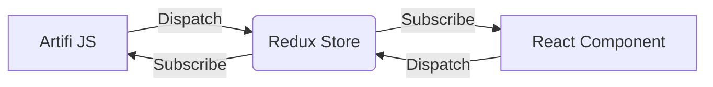

# Artifi React Component

This is a list of ARTIFI [React](https://reactjs.org/) components. Each component is standalone and works through [REDUX](https://react-redux.js.org) store. All component will build separately and integrate into Artifi using a single build file and all communication between Artifi and React components is through Redux store.

### Basic Data Flow Diagram


### Installation

 - Clone repo - `git clone https://github.com/sunilnkashyap/react-artifi-components.git`
 - Install dependencies - `npm install`

### Basic Use
Build components with - `npm run bundle:prod` command, this command will build components and generate build files into `demo/COMPONENT_FOLDER` location.
```
react-artifi-components
├── ...
├── node_modules
├── package.json
├── ...
├── demo
	├── store
    │   └── Store.js    <-- Redux Store build file
    ├── text
    │   ├── index.html
    │   └── text-component.js    <-- Text component build file
    ├── graphics
        ├── index.html
        └── graphics-component.js    <-- Graphics component build file

```

Host Demo folder to localhost and execute `index.html` file.

> Hosting through IIS - IIS Manager > Add new website.
> Point physical path to **demo** folder and set port 8085
> visit http://localhost:8085/COMPONENT 
> COMPONENT - text | graphics


## Component Integration with VanillaJS

 1. To integrate component with VanillaJS requires 4 main file.

 - React.js   -- React Library 
 - React-dom.js  -- React DOM Library
 - Store.js -- Redux Store Build File
 - Component-build.js - Component Build File

> `npm run bundle:prod` command generates components build file.

Include all JS into VanillaJS project

    <script src="./react.js"></script>
    <script src="./react-dom.js"></script>
    <script src="./Store.js"></script>
    <script src="./text-component.js"></script>

 2.  Create React container HTML element.

    <div id='root'></div>

 3. Initialize react component
ReactDOM will render react component into the referance element.
`ReactDOM.render(element, container[, callback])`

Example code.

    ReactDOM.render(
    React.createElement(Artifi.TextComponent.TextComponent),
    document.getElementById('root') );

**Artifi variable**
by default all component is in an object called **Artifi** (predefined configuration).

    Artifi : {
    	TextComponent : {
    		TextComponent : REACT COMPONENT CLASS,
    		TextActions : TEXT_ACTION_CONSTANTS
    	},
    	GraphicsComponent : {
    		GraphicsComponet : REACT COMPONENT CLASS
    	}
    }
***
**Subscribe Redux Store Changes**
### **_Artifi variable**
Bydefault Redux Store is init into **_Artifi** variable, so you can access Redux Store through `_Artifi.Store`

#### Subscribe Redux Store

    _Artifi.Store.subscribe(function(){ /* Logic */ });

#### Get Redux Store State

    _Artifi.Store.getState();

***


